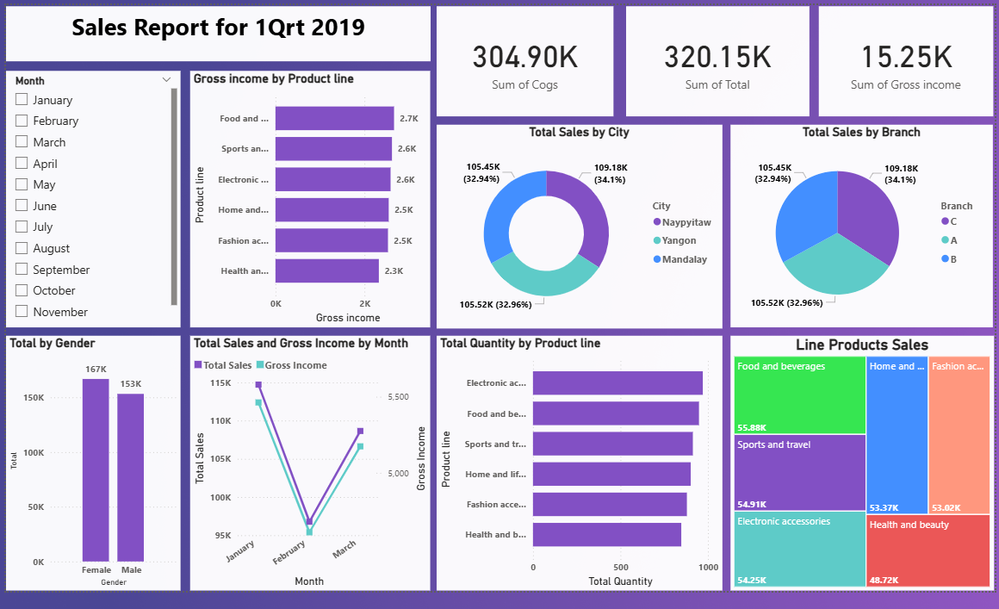

# Supermarket Sales Power BI Dashboard 📊

This project presents an interactive Power BI dashboard analyzing supermarket sales for Q1 2019. It provides insights into revenue, product performance, and customer demographics.

## 📂 Folder Structure
- **data/** → Raw dataset in Excel format.
- **dashboard/** → Power BI `.pbix` file for full interactivity.
- **screenshots/** → Dashboard preview images.

## 📈 Key Insights
- Top-performing product lines by gross income.
- Sales trends by month, gender, and city.
- Branch-level performance comparison.
- Customer purchasing patterns.

## 🧠 Tools Used
- Microsoft Power BI
- Excel

## 📸 Dashboard Preview

## 📊 Dataset
The dataset is included in `/data/supermarket_sales.xlsx`.

## 📄 How to Open
1. Download the `.pbix` file from `/dashboard/`.
2. Open it in **Microsoft Power BI Desktop**.