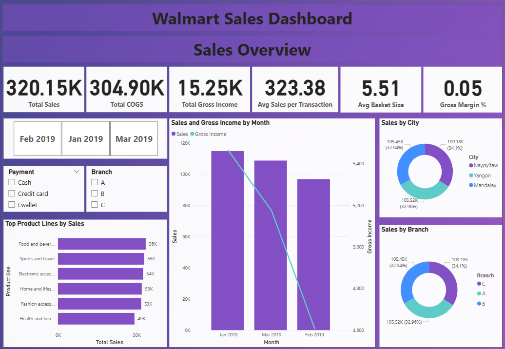

# Supermarket Sales Power BI Dashboard 📊

This project presents an interactive Power BI dashboard analyzing supermarket sales for Q1 2019. It provides insights into revenue, product performance, and customer demographics.

## 📂 Folder Structure
- **data/** → Raw dataset in Excel format.
- **dashboard/** → Power BI `.pbix` file for full interactivity.
- **screenshots/** → Dashboard preview images.

📈 Key Insights

-Top-performing product lines ranked by gross income.

-Monthly sales & profit trends for the quarter.

-Branch-level performance comparison.

-Customer demographics breakdown by gender.

-Sales distribution across cities and product categories.

📊 Visualizations in the Dashboard

-Slicer: Month selector to filter all visuals.

-Bar Chart: Gross income by product line.

-Card Visuals: Total COGS, total sales, and gross income.

-Donut Chart: Total sales by city.

-Donut Chart: Total sales by branch.

-Bar Chart: Total sales by gender.

-Line & Clustered Column Chart: Total sales & gross income by month.

-Bar Chart: Total quantity sold by product line.

-Tree Map: Sales distribution across product lines.

🧠 Tools Used

Microsoft Power BI – Dashboard creation & visualization

Microsoft Excel – Data source & preparation

## 📸 Dashboard Preview

## 📊 Dataset
[Download the dataset here](Data)

## 📄 How to Open
1. Download the `.pbix` file from `/dashboard/`.

2. Open it in **Microsoft Power BI Desktop**.

